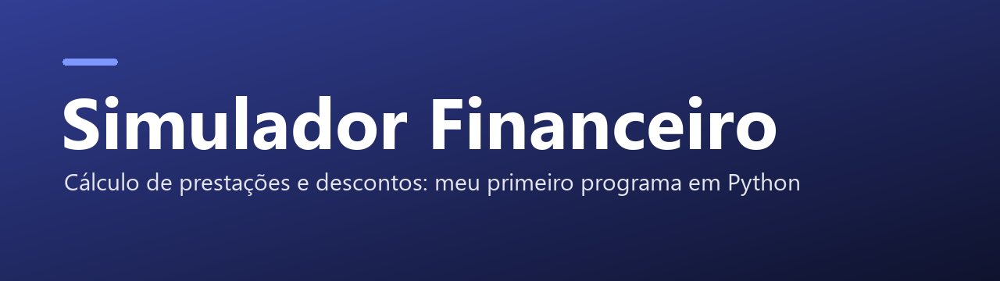

  

  
  
  

Calculadora de prestações e descontos com interface gráfica em Python (Tkinter) — meu primeiro programa, feito para a faculdade.

---

## ✨ O que é

Uma calculadora de **prestações** e **descontos** com janela gráfica. Nasceu como trabalho pedido pelo meu professor na faculdade: a primeira versão foi escrita em **Portugol** e depois refeita do zero por mim em **Python** — foi o meu primeiro programa.

## 🚀 Como usar

| Arquivo | Como abrir |
|---|---|
| `Prestaçao e Desconto 1.4.py` | precisa do Python instalado: `python "Prestaçao e Desconto 1.4.py"` |
| `Prestaçao e Desconto 1.4 'No Py'.exe` | roda direto no Windows, sem Python |

> O Windows Defender às vezes reclama do `.exe` por causa da forma como ele é empacotado — o código-fonte equivalente está no `.py`, aberto para conferência.

Veja também a seção **Releases** com todas as versões.

---

Feito por <a href="https://github.com/Davicjc">Davi Castro</a> · <a href="https://davicjc.com">davicjc.com</a>

